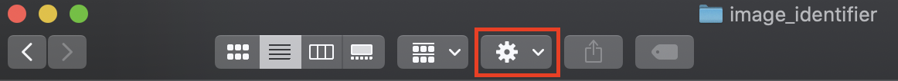
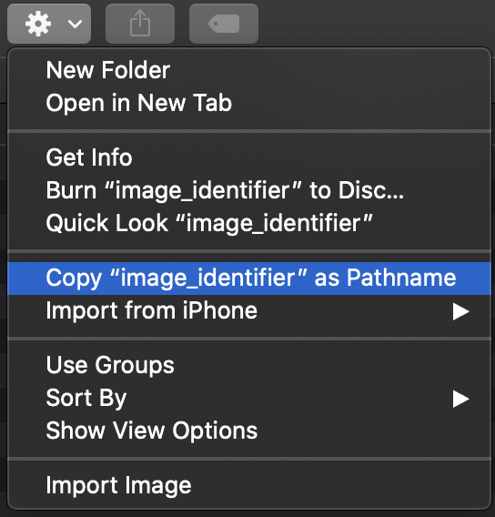

## Get the starter files

You're going to do this project on your computer, and you'll be using some starter code that will handle setting up the application for you, so you can focus on the machine learning part. The first thing you need to do is get that code and set it up.

--- task ---
Download the [starter zip file](#) and unzip it somewhere you'll remember on your computer. If you can't think of a location, just put it on your desktop. This isn't the best place to keep things in the long term, but it's fine when you're working on them.
--- /task ---

Next, you need to install the libraries you're going to be using in this project. For this, you'll need to use the **command line interace** (CLI) — a program for controlling your computer by typing text commands into a window. The command line interface is called 'command prompt' in Windows and 'terminal' in Mac OS and Linux.

In the CLI, you don't access files by clicking to open them, or the directories (folders) they live in. You need to know the **path** to the file. It's like a set of directions, either from where you are currently located on the computer — called a **relative path** — or from the root of the computer's hard drive — called an **absolute** path. You'll need to find the path to the directory you've just unzipped for this next step.

--- collapse ---
---
title: Finding the path to a directory on Windows
---

TODO — WRITE UP PATH FINDING INSTRUCTIONS FOR WINDOWS

--- /collapse ---

--- collapse ---
---
title: Finding the path to a directory on Mac OS
---

To find the path to a directory on Mac OS: 

  + Open the directory in Finder as you normally would, by double-clicking on its icon (the folder).
  + At the top of the window that opens, click on the action button (the one with a cog icon). 

  
  
  + In the menu that appears, select the 'Copy [directory name] as pathname' option. 
  
  

The path to the directory will now be stored in the clipboard and can be pasted wherever you need it.

--- /collapse ---

--- collapse ---
---
title: Finding the path to a directory on Linux (including Raspbian)
---

TODO — WRITE UP PATH FINDING INSTRUCTIONS FOR RASPBERRY PI

--- /collapse ---

--- task ---
Open the CLI on your computer and type the command below in, replacing `[path to directory]` with the path you coppied using the instructions above. 

```bash
cd [path to directory]
```

Now press the **return** key to run the command and move to that directory.

--- /task ---

Note that many commands are different for the CLI used in Windows and the one used Mac OS or Linux. By luck, the command for moving between folders, `cd` (change directory), isn't one of them.