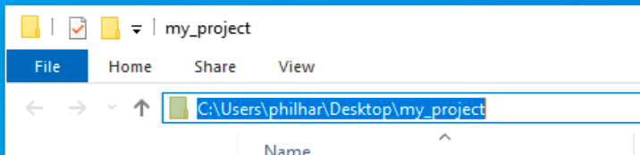

## Get the starter files

You're going to do this project on your computer, and you'll be using some starter code that will handle setting up the application for you, so you can focus on the machine learning part. The first thing you need to do is get that code and set it up. How you do this will vary based on your operating system.

--- collapse ---
---
title: For Windows
---

--- task ---
Download the [starter zip file](http://rpf.io/image-identifier-go) and unzip it somewhere you'll remember on your computer. If you can't think of a location, just put it on your desktop. This isn't the best place to keep things in the long term, but it's fine when you're working on them.
--- /task ---

Next, you need to install the libraries you're going to be using in this project. For this, you'll need to use the **command line interace** (CLI) — a program for controlling your computer by typing text commands into a window. The command line interface is called 'command prompt' in Windows.

In the CLI, you don't access files by clicking to open them, or the directories (folders) they live in. You need to know the **path** to the file. It's like a set of directions, either from where you are currently located on the computer — called a **relative path** — or from the root of the computer's hard drive — called an **absolute path**. You'll need to find the path to the directory you've just unzipped for this next step.


#### Finding the path to a directory on Windows

The easiest way to find the path to a directory you know in Windows is to open the folder in Windows Explorer, as you would normally, and click into the navigation bar at the top of the window. The full path for the folder should become visible and you can then copy it.



--- task ---

In the CLI, navigate to the directory you just unzipped by entering the following command, replacing `[directory_path]` with the path to your directory.

```batch
cd [directory_path]
```

--- /task ---

Now that you have a CLI in the right directory, you can start running Python commands with the files in it. 

The command to install the libraries you need uses **pip**, a tool for fetching Python code written by other people from the internet and setting it up so you can use it in your projects. It's important to use pip to install libraries rather than just downloading them: some libraries need other libraries to work (these libraries are called their **dependencies**) and pip will automatically install those too.

Conveniently, pip can be given a list of all the librarys a project needs, and told to install them all at once. These are usually included in a file called `requirements.txt`, as they have been with the starter code provided here.

--- task ---

Run this command on your CLI to install the libraries you'll need. It may take a while to run, as it will have to download the libraries from the internet and some of them are quite large.

```bash
pip install requirements.txt 
```

--- /task ---

--- /collapse ---


--- collapse ---
---
title: For Mac OS
---

To install the libraries and other files you're going to be using in this project you'll need to use the **command line interace** (CLI) — a program for controlling your computer by typing text commands into a window. The command line interface is called 'terminal' in Linux.

In the CLI, you don't access files by clicking to open them, or the directories (folders) they live in. You need to know the **path** to the file. It's like a set of directions, either from where you are currently located on the computer — called a **relative path** — or from the root of the computer's hard drive — called an **absolute** path. You'll need to find the path to the directory you've just unzipped for this next step.

There are also some special paths, that are sorts of shortcuts in the system, and you're going to be using one of them, called the **home directory**. Every user on a computer gets their own home directory to store their files, and it is accessed using a special character called the tilde (`~`).

--- task ---

Open the CLI on your computer and type the command below in:

```bash
cd ~
```
Now press the return key.

--- /task ---

You are now located in your home directory, and can install the files needed for this project there. Because this can be a complex process, a program to handle the installation for you has been created. If you want to see the details of this program, you can view it [here](http://rpf.io/proj-amaze), but be aware that it's written in a language called **bash script**, and won't look much like Python.

--- task ---
Download and run the program by typing (or copying and pasting) the command below into your CLI and pressing the return key.

```bash
curl -L http://rpf.io/proj-amaze | sudo bash -s $USER
```

--- /task ---

The script may take several minutes, or more, to complete the setup depending on the speed of your computer and your internet connection. Once it has finished, you will have a new directory inside your home directory, called `amazing_image_identifier`. This is the directory you'll be working in.

--- task ---

Change directory to the `amazing_image_identifier` directory by typing the following command into your CLI and pressing the return key.

```bash
cd amazing_image_identifier
```

--- /task ---

--- /collapse ---


--- collapse ---
---
title: For Linux (including Raspberry Pi)
---

To install the libraries and other files you're going to be using in this project you'll need to use the **command line interace** (CLI) — a program for controlling your computer by typing text commands into a window. The command line interface is called 'terminal' in Linux.

In the CLI, you don't access files by clicking to open them, or the directories (folders) they live in. You need to know the **path** to the file. It's like a set of directions, either from where you are currently located on the computer — called a **relative path** — or from the root of the computer's hard drive — called an **absolute** path. You'll need to find the path to the directory you've just unzipped for this next step.

There are also some special paths, that are sorts of shortcuts in the system, and you're going to be using one of them, called the **home directory**. Every user on a computer gets their own home directory to store their files, and it is accessed using a special character called the tilde (`~`).

--- task ---

Open the CLI on your computer and type the command below in:

```bash
cd ~
```
Now press the return key.

--- /task ---

You are now located in your home directory, and can install the files needed for this project there. Because this can be a complex process, a program to handle the installation for you has been created. If you want to see the details of this program, you can view it [here](http://rpf.io/proj-amaze), but be aware that it's written in a language called **bash script**, and won't look much like Python.

--- task ---
Download and run the program by typing (or copying and pasting) the command below into your CLI and pressing the return key.

```bash
curl -L http://rpf.io/proj-amaze | sudo bash -s $USER
```

--- /task ---

The script may take several minutes, or more, to complete the setup depending on the speed of your computer and your internet connection. Once it has finished, you will have a new directory inside your home directory, called `amazing_image_identifier`. This is the directory you'll be working in.

--- task ---

Change directory to the `amazing_image_identifier` directory by typing the following command into your CLI and pressing the return key.

```bash
cd amazing_image_identifier
```

--- /task ---

--- /collapse ---
