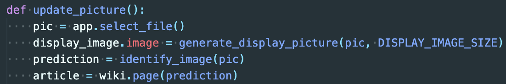
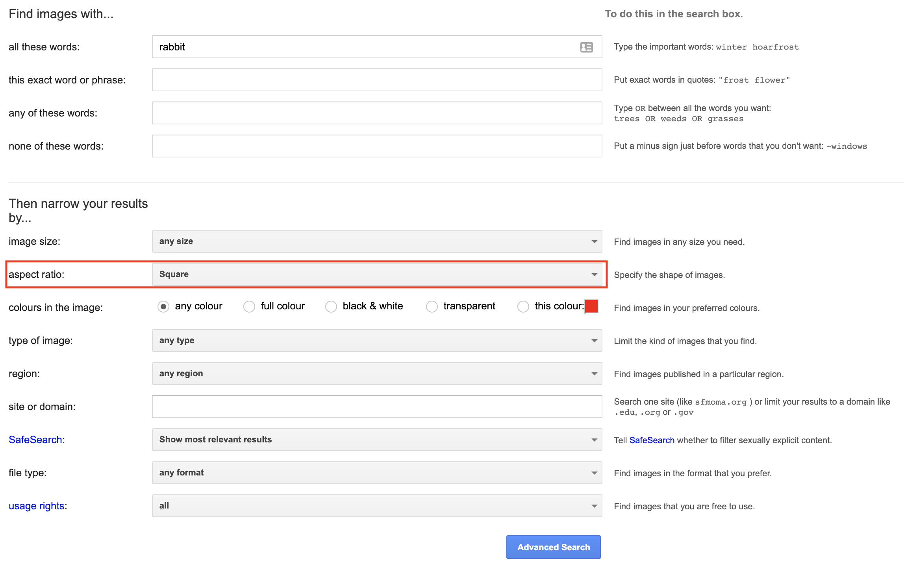

## Connect to Wikipedia

Now that you've got a prediction for the image, you need to connect to Wikipedia to get some information about that prediction to share with your users. Again, you can use a library for this, so the first thing you need to do is import that library:

--- task ---

Go to the `import` statements at start of the `project.py` file and add this line:

```python
import wikipedia as wiki
```

--- /task ---

Now you need to fetch the Wikipedia article that best matches your prediction.

--- task ---

In the `update_picture` function, just below where you get your model's prediction, add a line that uses the Wikipedia library to get the page information for the nearest match to your prediction and store it in a variable called `article`.

```python
article = wiki.page(prediction)
```



--- /task ---

Right now, you're printing out the prediction to the CLI. To get the application to display information in a user-friendly way, it should update the user interface when it has gotten results from Wikipedia. To do this, change the title shown in the application to match the title of the Wikipedia article, and update the text to the summary text from the article — using a function that has been provided in the `project.py` file.

--- task ---

Still working in the `update_picture` function, below the line where you create the `article` variable, add two lines to update the title and text box.

```python
title.value = article.title
update_text_box(article.summary)
```

--- /task ---

--- save ---

--- task ---

Run the program again and try select some of the pictures included in the project's directory, to see what articles appear in the application.

Try some other pictures from your computer, or the internet too. Since it works best with square images, you may want to use the [Google Advanced Image Search](https://www.google.com/advanced_image_search) tool and set the **aspect ratio** to 'Square'.



--- /task ---
